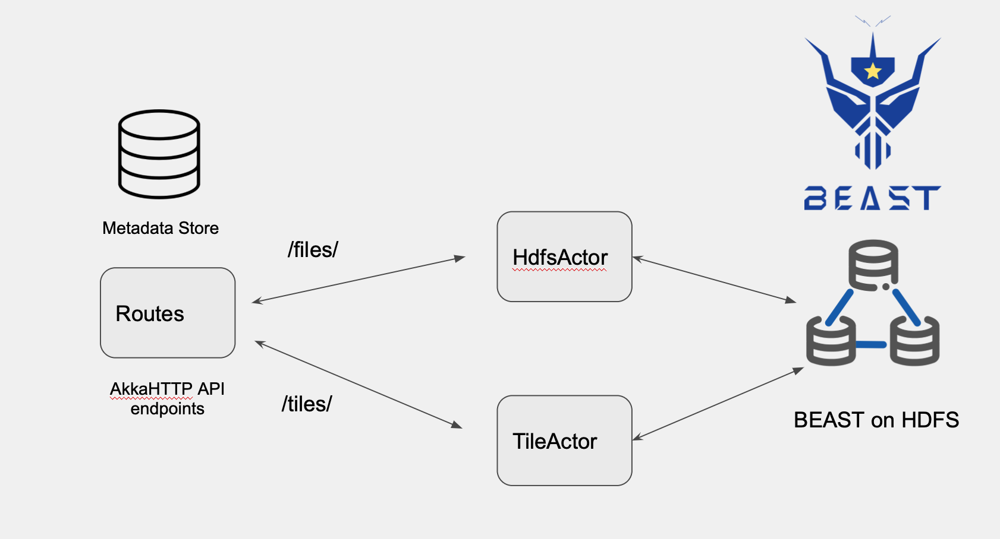

# Beast Microservice
The microservice backend is to enable upload and processing of Spatial-Temporal data files on the Hadoop using Spark and BEAST library. 

There were a few design considerations and AkkaHTTP was deemed a good fit for the API. It is a lightweight but feature-rich and highly scalable toolkit for building API endpoints based on the Actor Model and message passing. It uses the functional programming paradigm which is ideal for using with Spark and BEAST.

### Akka and AkkaHTTP 
* Concurrency through message passing (Actors)
* Non-blocking by default (Futures)
* Fault Tolerance (a.k.a. Resiliency, ‘let it crash’ model) 

By building the endpoints using actors and separating the indexing/partitioning jobs and tile generation jobs, we can achieve a degree of parallelism in our API. Our project has three Actors

### Actors in BeastAPI
- **Routes.scala** : Entry point and handles routing logic. Passes messages to TileActor and HdfsActor 
- **HdfsActor.scala** : Partitioning and indexing job messages are received and performed by this Actor
- **TileActor.scala** : Tiles are generated on the fly from indexes by this actor

The actors can be deployed and scaled horizontally into the cluster using the Akka Cluster API. The following video is a good source of motivation to use [Akka-Cluster](https://akka.io/blog/news/2020/06/01/akka-cluster-motivation?_ga=2.208480850.1366963332.1650776591-1484330899.1642330423)

### Current Architecture design

 

### Using Akka ActorContext and Behaviors

A Scala object can be made into an Akka actor simply by importing `akka.actor.typed.scaladsl.ActorContext` and `akka.actor.typed.scaladsl.Behaviors` into your scala object. Use `Behaviours.setup` to create a match case for `ActorContext`. Any message passed to this actor will be processed depending on its match case.

A simple example would be

```
object MyActor{

    def apply(): Behavior[CommandTrait] = Behaviors.setup {
    context: ActorContext[CommandTrait] =>
      println("actors.HdfsRegistry: Hdfs Actor awake")

      Behaviors.receiveMessage {

        case SpeakText(msg) =>
          println(s"actors.HdfsActor: got a msg: $msg")
          Behaviors.same
        case _ =>
          println("Default Case")
          Behaviors.same
      }

    }
}

```

For the Actor to be visible to other actors in the server, we can register it to the `Receptionist`. Something like this would tell the receptionist to register the actor.
```
context.system.receptionist ! Receptionist.Register("KeyForNewActor", context.self)
```
More information on this can be found in this guide [akka-docs](https://doc.akka.io/docs/akka/current/typed/actors.html)